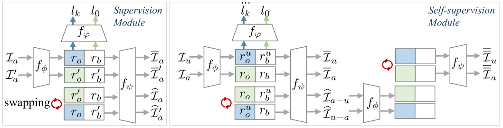

# One-GORD

- NeurIPS2020: [One-sample Guided Object Representation Disassembling](), (released soon)



## Dependencies

```xml
python3
tensorflow=1.8
pillow
py-opencv
scipy<1.3.0
scikit-learn
```

## SVHN Experiment

We give codes of all experiments on the SVHN datasets in our paper, including AE, S-AE, DSD, One-GORD and its ablation study methods. About MONet and IODINE method, please refer to: <https://github.com/baudm/MONet-pytorch> and <https://github.com/zhixuan-lin/IODINE>.

Here, we set 'unitLength=50' as an example. The part length is the length of each part of the representation, which can be set to any integer that is large than 0. In the code file,  the part length is denoted as 'unitLength'.

### Datasets

First, Download the [dataset](https://www.dropbox.com/sh/rlm17d4lxzubrwk/AAAQ4gZpGaiE3jsGbtUAl-YYa?dl=0).

The dataset generation examples (all datasets are saved in ```./npz_datas/``` as ```npz``` format) are given as follows:

1. Run ```main_generateSVHN10_train_forOnesample``` to generate the **training datasets** for One-GORD and AE.
2. Run ```main_generateSVHN10_train_forSAE.py``` to generate the **training datasets** for S-AE.
3. Run ```main_generateSVHN10_train_forDSD.py``` to generate the **training datasets** for DSD.
4. Run ```main_generateSVHN10_testWithLabel_forSwapVisual.py``` to generate the visual images for image editing.
5. Run ```main_generateSVHN10_testWithLabel_forMetrics.py``` to generate the **testing datasets** for classification metrics evaluation.
6. Run ```main_generateSVHN10_testWithLabel_forModularity.py``` and ```main_generateSVHN10_testWithLabel_forVisualIntegrity.py``` to generate the **testing datasets** for  modularity and integrity evaluation.

### Training

After preparing the datasets, we can train the model with ```main.py```, which is given in the directory of each method.


One-GORD

````shell
cd One-GORD\Ours
python main.py
````

Ablation study

````shell
cd One-GORD\Ours-f # Ours-0 or Ours-s
python main.py
````

AE

```shell
cd AE
python main.py
```

S-AE

```shell
cd SAE/SAE_part2_unitLength50
python main.py
```

DSD

```shell
cd DSD\dual_diaeMnist_unitLeng50
python main.py
```

The intermediate results in training stage will be saved in ```./samples/```

### Testing

Now we can use the trained model to do visualization testing! Please choose the best model which  can produce the best result in ```./samples/``` folder. For example, the best reconstructed image is ```2000X1head_aux1bg.png```, which means that we have the best model's ckpt when step=2000.

For example, with step=2000, we need modify one line code in the corresponding test file.

```python
# change the ckpt number
saved_step = AE.load_fixedNum(inter_num=2000)
```

One-GORD

```shell
cd One-GORD\Ours
python test_for_SwapVisual.py
```

Ablation study

```shell
cd One-GORD\Ours-f # Ours-0 or Ours-s
python test_for_SwapVisual.py
```


AE

```shell
cd AE
python test_for_SwapVisual.py
```

S-AE

```shell
cd SAE/SAE_part2_unitLength50
python test_for_SwapVisual.py
```

DSD

```shell
cd DSD\dual_diaeMnist_unitLeng50
python test_for_SwapVisual.py
```

The results will be saved in ```./VisualImgsResults/```

### Calculate metric scores

We can ```cd``` to each method directory for calculating the metric scores. Notes: please set the trained model before running scripts. We give One-GORD as the example and the other methods are the same.

One-GORD as example

```shell
# cd our_work_path
cd One-GORD/Ours # or other method directory
# please set the ckpt which to be loaded from our_work_path
python test_getRepreCodes_forMetrics.py
# calculate classificaiton metrics
python classify_metrics_cal.py
# please set the ckpt which to be loaded from our_work_path
python test_for_VisualIntegrity.py
# calculate visual integrity metrics
python visualIntegrity_metrics_cal.py
# please set the ckpt which to be loaded from our_work_path
python test_for_Modularity.py
# calculate modularity metrics
python modularity_metrics_cal.py
```
## Citation

Soon.

## Contact

If you have any questions, please feel free to contact

Zunlei Feng, zunleifeng@zju.edu.cn

Yongming He, yongminghe@zju.edu.cn


